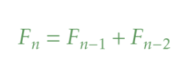
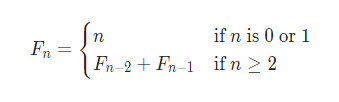

# Fibonacci Number

## Overview
Compute the n-th Fibonacci number.

- **Input:** An integer _n_;
- **Output:** _n_-th Fibonacci number.



## Description
Fibonacci numbers are defined recursively:



resulting in the following recursive algorithm:

```
Fibonacci(n):
    if n <= 1:
        return n
    else:
        return Fibonacci(n - 2) + Fibonacci(n -1)
```

- **Input format.** An integer _n_.
- **Output format.** F<sub>n</sub>.
- **Constraints.** 0 <= n <= 45.

## Examples
Sample 1.
```
Input:
3
Output:
2
```

Sample 2.
```
Input:
10
Output:
55
```

Sample 3.
```
Input:
0
Output:
0
```

Sample 4.
```
Input:
1
Output:
1
```